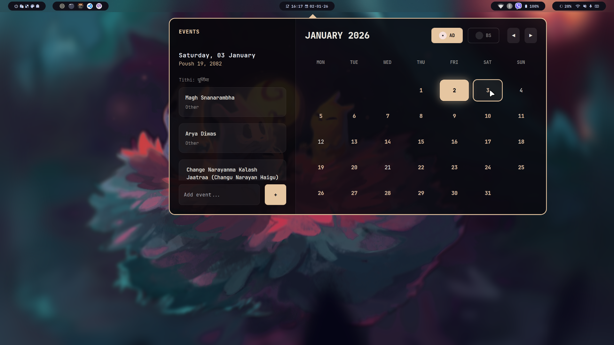
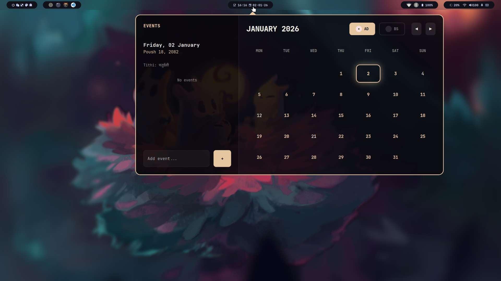
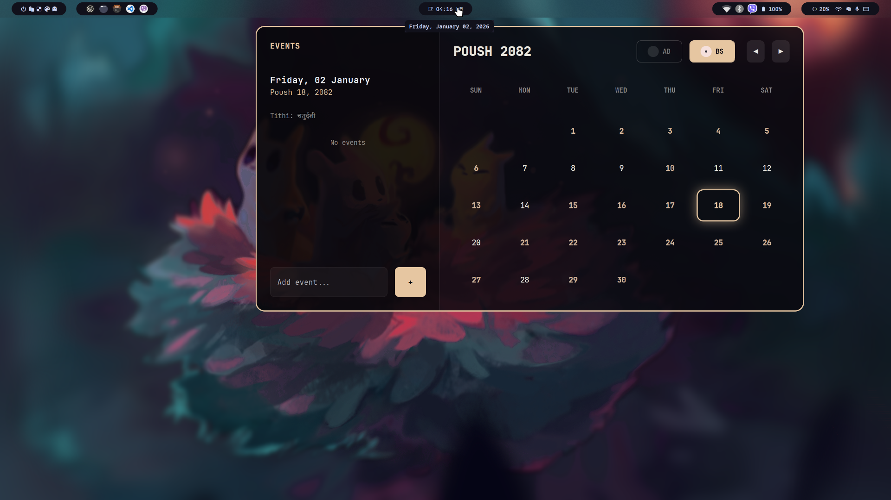
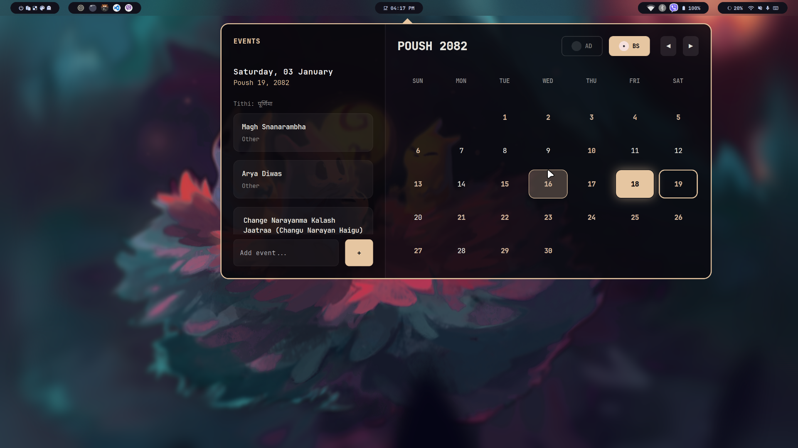

# Waybar Calendar Widget

I built this calendar widget for Waybar because I wanted something that looked good and actually worked well with Hyprland. It supports both **Gregorian (AD)** and **Bikram Sambat (BS)** calendar systems, which was a big requirement for me.



## What it does

- **AD & BS Support**: You can switch between Gregorian and Bikram Sambat calendars easily.
- **Events**: You can add your own events directly from the widget.
- **Smart Positioning**: It pops up right under your clock (or wherever you clicked), and has a little arrow pointing to it. It figures out which monitor you are on automatically.
- **Theming**: It tries to match your **Hyprland** active border colors or **Pywal** theme. If it can't find those, it falls back to a nice **Catppuccin Mocha** scheme.
- **UI/UX**: It has a transparent, blurred background and feels like a native popup. You can click outside of it to close it.
- **Nepali Holidays**: It knows about major Nepali holidays and Tithis.

## Gallery

| AD View | BS View |
|---------|---------|
|  |  |

*Event Management:*


## Prerequisites

You'll need these installed on your system:

- **Python 3**
- **GTK 3**
- **GtkLayerShell** (libgtk-layer-shell)
- **Hyprland** (Recommended for automatic positioning and theming)
- **Waybar**

### Python Dependencies
The widget uses standard Python libraries (`gi`, `datetime`, `json`, `subprocess`), so you usually don't need to `pip install` anything if you have the system GTK bindings installed.

## Installation

1. **Clone the repository**:
   ```bash
   git clone https://github.com/yourusername/waybar-calendar.git
   cd waybar-calendar
   ```

2. **Make the script executable**:
   ```bash
   chmod +x waybar_calendar.py
   ```

3. **Move to your Waybar config** (Optional but recommended):
   ```bash
   mkdir -p ~/.config/waybar/scripts
   cp -r * ~/.config/waybar/scripts/
   ```

## Configuration

### Waybar Config (`config.jsonc`)

Add this to your Waybar module configuration to launch the calendar when clicking the clock:

```jsonc
"clock": {
    "format": "{:%H:%M}",
    "tooltip-format": "<big>{:%Y %B}</big>\n<tt><small>{calendar}</small></tt>",
    "on-click": "~/.config/waybar/scripts/waybar_calendar.py"
}
```

### Customizing Colors

The widget automatically looks for colors in this order:
1. **Hyprland Active Border**: Matches your window borders.
2. **Pywal**: Looks for `~/.cache/wal/colors.json`.
3. **Default**: Uses the Catppuccin Mocha palette.

If you want to force specific colors, you can modify the `get_hyprland_colors()` function in `calendar_styles.py`.

## Usage

- **Open**: Click your Waybar clock.
- **Close**: Click anywhere outside the calendar widget or press `Esc`.
- **Switch Mode**: Click the **AD** / **BS** toggle buttons in the header.
- **Add Event**: Select a date, type in the "Add event..." box, and click `+` or press Enter.
- **Delete Event**: Click the `×` button next to an event in the list.
- **Navigation**: Use the `◀` and `▶` buttons to switch months.

## Project Structure

- `waybar_calendar.py`: Main application entry point and UI logic.
- `calendar_styles.py`: Handles CSS generation and theming.
- `bikram_sambat.py`: Core logic for Bikram Sambat date conversion and holidays.
- `bs_data/`: JSON data for BS calendar years.

## Contributing

Contributions are welcome! Please feel free to submit a Pull Request.

1. Fork the Project
2. Create your Feature Branch (`git checkout -b feature/AmazingFeature`)
3. Commit your Changes (`git commit -m 'Add some AmazingFeature'`)
4. Push to the Branch (`git push origin feature/AmazingFeature`)
5. Open a Pull Request

## License

Distributed under the MIT License. See `LICENSE` for more information.
